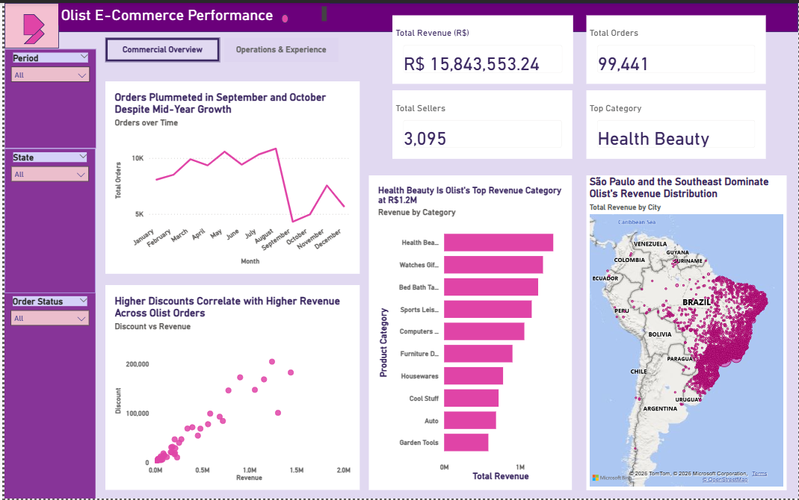
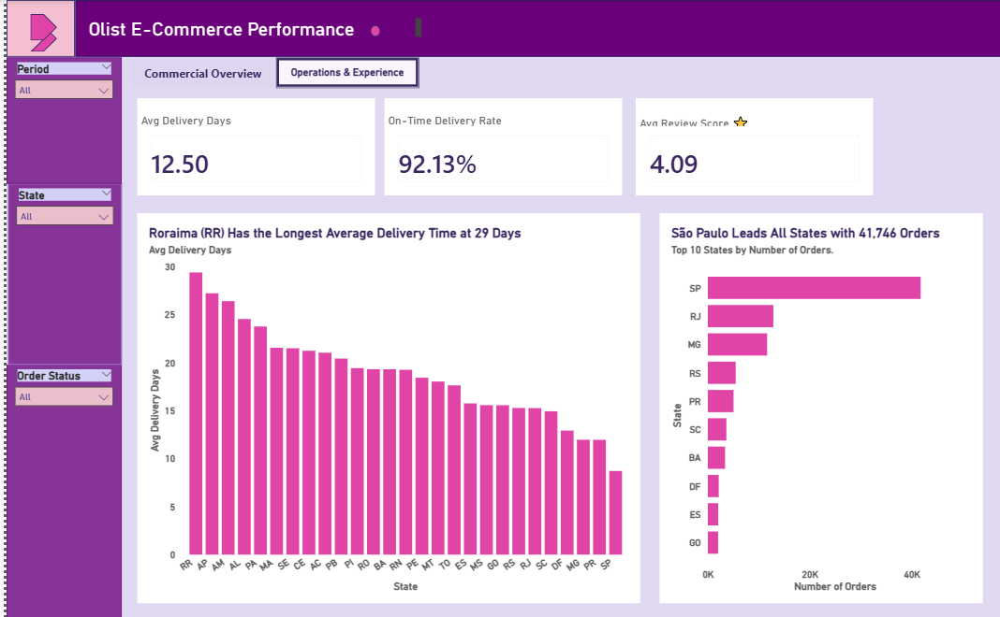

# P2 — Brazilian E-Commerce Performance by Olist
### Commercial Overview and Operations & Experience Analysis

---

## Project Overview

This project analyses a real-world Brazilian e-commerce dataset provided by Olist, covering 99,441 orders across multiple states, product categories, and sellers. The goal was to uncover revenue distribution, delivery performance, customer satisfaction patterns, and seller behaviour across the platform.

---

## Business Questions

1. What are the total orders and revenue by state?
2. Which product categories generate the most revenue?
3. Who are the best-performing sellers by revenue and orders?
4. Who are the worst-performing sellers by revenue and orders?
5. How does actual delivery performance compare to estimated delivery time?
6. What is the average review score by product category?

---

## KPIs

| Metric | Value |
|--------|-------|
| Total Revenue | R$ 15,843,553.24 |
| Total Orders | 99,441 |
| Total Sellers | 3,095 |
| Avg Review Score | 4.09 |
| Avg Delivery Days | 12.50 |
| On-Time Delivery Rate | 92.13% |

---

## Tools Used

| Tool | Purpose |
|------|---------|
| Excel | Data cleaning and preparation across 8 tables |
| PostgreSQL | Multi-table joins, KPI queries, business questions |
| Power BI | Two-page interactive dashboard |

---

## Dataset

- **Source:** [Brazilian E-Commerce Public Dataset by Olist](https://www.kaggle.com/datasets/olistbr/brazilian-ecommerce) — Kaggle
- **Size:** 100K+ orders, 8 tables
- **Tables used:** `olist_orders`, `olist_order_items`, `olist_order_payments`, `olist_order_reviews`, `olist_customers`, `olist_sellers`, `olist_products`, `product_category_name_translation`

---

## Key Findings

- **Sao Paulo (SP)** dominates with 41,746 orders, far ahead of all other states
- **Health Beauty** is the top revenue-generating category at R$1.2M
- **92.13%** of orders were delivered on time, with an average delivery time of 12.50 days
- **Roraima (RR)** has the longest average delivery time at 29 days, reflecting the challenges of reaching remote northern states
- Orders grew steadily through mid-year before a sharp drop in September and October
- Higher discount values correlate with higher revenue across Olist orders
- Average customer review score of **4.09** out of 5 reflects strong overall satisfaction

---

## Dashboard Preview

### Page 1 — Commercial Overview


### Page 2 — Operations & Experience


---

## File Structure

```
P2 — Brazilian E-Commerce by Olist/
├── p2_sql_queries.sql                     # KPI queries + 6 business questions
├── P2_Olist_Ecommerce_Dashboard.pbix      # Hosted on Google Drive (exceeds 25MB limit)
├── P2_Olist_SCR_Presentation_FIXED.pptx  # 5-slide SCR presentation
├── olist_customers_dataset.csv
├── olist_order_items_dataset.csv
├── olist_order_payments_dataset.csv
├── olist_order_reviews_dataset.csv
├── olist_orders_dataset.csv
├── olist_products_dataset.csv
├── olist_sellers_dataset.csv
├── product_category_name_translation.csv
├── Query_Output/                          # Screenshots of SQL query results
├── Images/                               # Dashboard screenshots
└── README.md
```

---

## How to Use

- Open `p2_sql_queries.sql` in pgAdmin or any PostgreSQL client to view and run the queries
- The Power BI dashboard file (.pbix) exceeds GitHub's 25MB upload limit and is hosted on Google Drive. [Click here to access the Power BI dashboard file](https://drive.google.com/file/d/1BW_8R3EAWo9Tjk0UCt-h_-VazdzhUbfL/view?usp=drive_link)
- Open `P2_Olist_SCR_Presentation_FIXED.pptx` to view the stakeholder presentation

---

## Key Learnings

- Working with real-world data including UUIDs, encoding issues, and multi-table schemas
- Managing a multi-fact schema with `olist_order_items` as the primary fact table and `olist_order_payments` as secondary
- Using `order_id` as the spine to join across all 8 tables
- Filtering delivery analysis to `order_status = 'delivered'` only for accuracy

---

*Project completed May 2026 as part of a structured 20-week self-directed Data Analytics programme.*  
*Tools covered: Excel | SQL | Power BI | Python*
